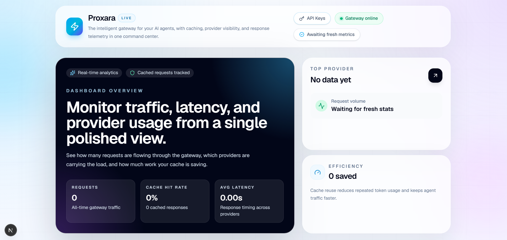

<div align="center">
	<h1>⚡ Proxara</h1>
	<p><strong>The intelligent gateway for your AI agents.</strong></p>
	<p>
		Circuit breaking, semantic caching, and multi-provider 
		failover in two lines of code.
	</p>

  <p>
    
    
    
    
  </p>

</div>

---



---

## What is Proxara?

Proxara is an open source AI gateway that sits between 
your application and LLM providers like Claude/Gemini/OpenAI.

```
Your App → Proxara → OpenAI / Groq / Anthropic
```

Every request passes through four intelligent layers 
automatically - no changes to your existing code needed.

---

## The Problem It Solves

| Problem | Without Proxara | With Proxara |
|---------|----------------|--------------|
| Agent loops | Burns thousands of tokens | Circuit breaker blocks it |
| Same questions | Pays full price every time | Cache returns answer free |
| OpenAI downtime | App completely breaks | Auto switches to Groq |
| No visibility | No idea what it costs | Full dashboard |

---

## Features

###  Stateful Circuit Breaking
Automatically detects when an AI agent is 
looping or failing. Blocks the agent after 
5 failures within 60 seconds. Protects your 
API budget from runaway agents.

###  Semantic Caching
Converts prompts to vector embeddings and 
stores responses in Pinecone. Identical or 
similar questions return cached answers 
instantly with zero token cost.

###  Multi-Provider Failover
If OpenAI goes down, Proxara automatically 
routes to Groq without your app knowing. 
Configurable provider priority.

###  Real-Time Dashboard
Beautiful Next.js dashboard showing total 
requests, cache hit rate, tokens saved, 
average latency, and provider breakdown.

###  API Key Management
Generate, copy, and revoke API keys directly 
from the dashboard. Full multi-tenant isolation 
so each key gets its own circuit breaker and 
cache namespace.

---

## Quick Start -  Two Lines of Code

```javascript
// BEFORE - direct OpenAI
const client = new OpenAI({
	apiKey: 'sk-your-openai-key'
})

// AFTER - through Proxara
// Only these two lines change
const client = new OpenAI({
	apiKey: 'prx_live_your-proxara-key',
	baseURL: 'https://your-proxara-url.com/v1'
})

// Everything else stays exactly the same
const response = await client.chat.completions.create({
	model: 'gpt-4o-mini',
	messages: [{ role: 'user', content: 'Hello' }]
})
```

Works with Python too:

```python
from openai import OpenAI

client = OpenAI(
	api_key="prx_live_your-proxara-key",
	base_url="https://your-proxara-url.com/v1"
)
```

---

## Architecture
```
        Incoming Request
             │
             ▼
┌─────────────────────────┐
│   Layer 1: Auth          │
│   Validate Proxara key   │
│   Identify tenant        │
└────────────┬────────────┘
             │
             ▼
┌─────────────────────────┐
│   Layer 2: Circuit       │
│   Breaker (Redis)        │
│   Block failing agents   │
└────────────┬────────────┘
             │
             ▼
┌─────────────────────────┐
│   Layer 3: Semantic      │
│   Cache (Pinecone)       │
│   Return cached answers  │
└────────────┬────────────┘
             │
             ▼
┌─────────────────────────┐
│   Layer 4: Router        │
│   OpenAI → Groq failover │
│   Log to PostgreSQL      │
└────────────┬────────────┘
             │
             ▼
        LLM Response
```

---

## Tech Stack

| Layer | Technology | Purpose |
|-------|-----------|---------|
| Gateway | Node.js + Fastify | High performance proxy |
| State | Redis | Circuit breaker + Auth |
| Cache | Pinecone | Semantic vector cache |
| Database | PostgreSQL | Request logging |
| Dashboard | Next.js + Tailwind | Metrics and key management |
| Providers | OpenAI + Groq | LLM providers |

---

## Self Hosting

### Prerequisites
- Node.js 20+
- Docker Desktop
- Groq API key (free)
- Pinecone API key (free)

### Installation

```bash
# 1. Clone the repo
git clone https://github.com/yourusername/proxara
cd proxara

# 2. Copy environment file
cp .env.example apps/gateway/.env

# 3. Fill in your API keys
# Edit apps/gateway/.env

# 4. Start infrastructure
docker compose up -d

# 5. Install dependencies
npm install

# 6. Start gateway
cd apps/gateway
npm run dev

# 7. Start dashboard (new terminal)
cd apps/dashboard
npm run dev
```

### Access

```
Gateway:   http://localhost:3001
Dashboard: http://localhost:3000
```

### Generate Your First API Key

```
1. Open http://localhost:3000/keys
2. Enter a name
3. Click Generate Key
4. Copy the key shown
```

---

## Environment Variables

| Variable | Required | Description |
|----------|----------|-------------|
| `OPENAI_API_KEY` | Optional | OpenAI API key |
| `GROQ_API_KEY` | Required | Groq API key (free) |
| `PINECONE_API_KEY` | Required | Pinecone API key (free) |
| `PINECONE_INDEX` | Required | Pinecone index name |
| `REDIS_URL` | Required | Redis connection URL |
| `DATABASE_URL` | Required | PostgreSQL connection URL |
| `PORT` | Optional | Gateway port (default 3001) |

---

## API Reference

### POST /v1/chat/completions

Compatible with OpenAI's chat completions API.

**Headers:**
```
Authorization: Bearer prx_live_your-key
Content-Type: application/json
```

**Body:**
```json
{
	"model": "gpt-4o-mini",
	"messages": [
		{ "role": "user", "content": "Hello" }
	]
}
```

**Response includes Proxara metadata:**
```json
{
	"choices": [...],
	"proxara": {
		"cached": false,
		"provider": "groq",
		"latencyMs": 843
	}
}
```

---

## Roadmap

- [x] Basic proxy server
- [x] Redis circuit breaker
- [x] Semantic cache with Pinecone
- [x] Multi-provider failover
- [x] Real-time dashboard
- [x] API key management
- [ ] Streaming support
- [ ] Usage billing per tenant
- [ ] Webhook alerts for tripped circuits
- [ ] More providers (Anthropic, Gemini)

---

## License

MIT — free to use, modify, and deploy.

---

<div align="center">
	<p>Built with ❤️ by <a href="https://github.com/Umeshinduranga">Umesh Induranga</a></p>
	<p>If this helped you, please ⭐ the repo</p>
</div>
